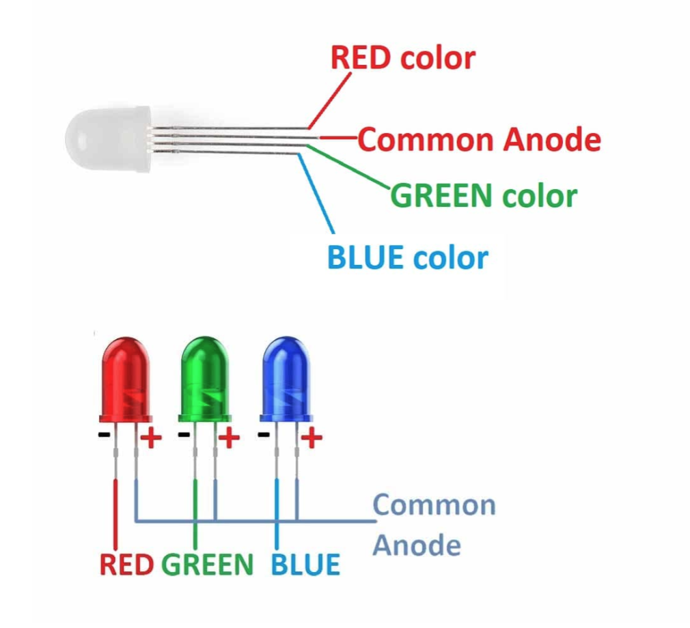
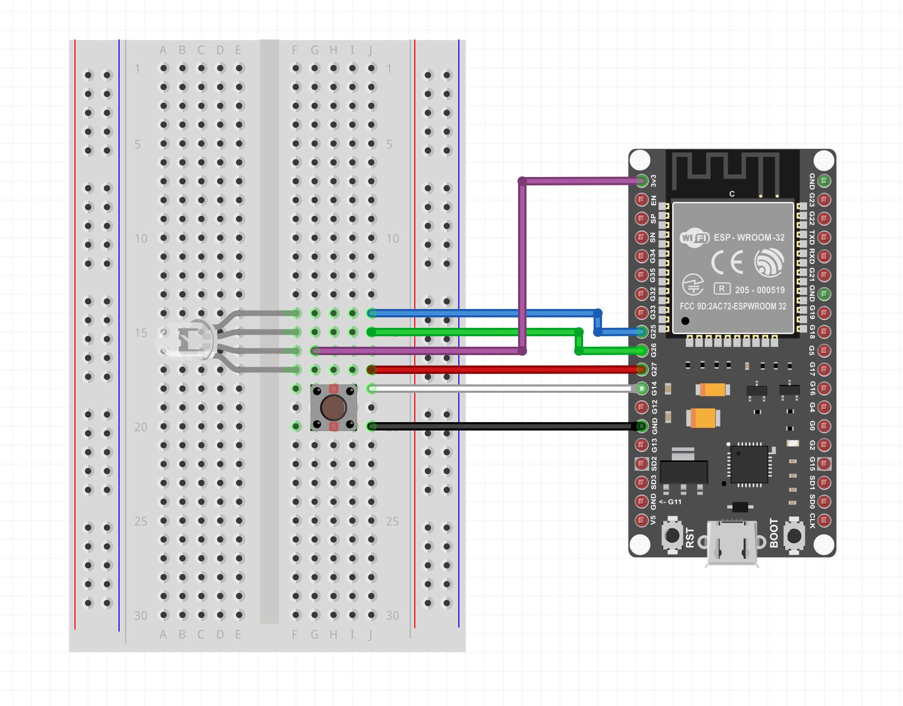
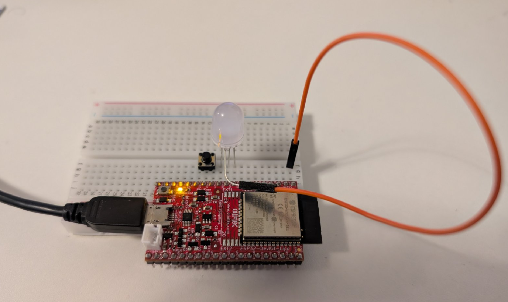

We are using Olimex [ESP32-DevKit-LiPo Board](https://github.com/OLIMEX/ESP32-DevKit-LiPo/blob/master/DOCS/ESP32-DevKit-LiPo-user-manual.pdf) which does not have builtin button and builtin LED, so you have to build our own simple schematic with external parts and breadboard to make examples using buttons and LEDs.

You already have some components to use - **push buttons, cables, LED, breadboard**. You can check here more details how to use bradboard: https://youtube.com/shorts/05ZrbtwUzMk?si=gIbFwLqku33tUpSa 

## RGB LED
You got RGB (Reg Green Blue) LED (light emitting diode), that have 3 separate colors in a single LED package and the colors can be mixed if two or more colors are turned on simultaneously. These LEDs have common anode, that means they have one common connection which is positive +3.3V. If you want to turn a color on, you need to connect the color pin to negative voltage bus. Here is a picture to explain it:



## Schematic and connections

- Pinout of the ESP32 board is shown [here](images/olimex_esp32.png).

- Schematic is [here](images/rgb_schematic.png).

- This is how the components should be connected on the breadboard (please note the ESP32 board looks different than the red Olimex but the pins are the same):



For simplicity the ESP32 board can be connected directly on the breadboard and only one cable is needed to connect the anode of the LED (+3.3V), like on this picture. Just manually twist the anode of the LED (the longest leg) and connect it with a male-female cable to bradboard. 



## Code to Run (Arduino Sketches)

1. Run this sketch in Arduino IDE, compile it and and upload it to the board, it will cycle the 3 colors with 1 sec interval:

```cpp
// Define PINs where the R, G and B colors are connected
const int blueLED = 26;
const int greenLED = 25;
const int redLED = 27;
// Define pin where the button is connected
const int button = 14; 

// the setup function runs once when you press reset or power the board
void setup() {
  // initialize digital pin LED_BUILTIN as an output.
  pinMode(blueLED, OUTPUT); // Blue LED
  pinMode(greenLED, OUTPUT); // Green LED
  pinMode(redLED, OUTPUT); // Red LED
  pinMode(button, INPUT_PULLUP); // Button pin, it have internal pullup resistor enabled so we don't have to add external one
}

// the loop function runs over and over again forever
void loop() {
  // These LEDs are having common anode (positive voltage or +), thus turing pin LOW (negative voltage or -) will turn it ON
  digitalWrite(blueLED, LOW);   // turn the LED on
  delay(1000);                  // wait for a second
  digitalWrite(blueLED, HIGH);  // turn the LED off by turning positive voltage
  digitalWrite(greenLED, LOW);  // turn the LED on by turining negative voltage
  delay(1000);                  // wait for a second
  digitalWrite(greenLED, HIGH); // turn the LED off by turning positive voltage
  digitalWrite(redLED, LOW);    // turn the LED on by turining negative voltage
  delay(1000);                  // wait for a second
  digitalWrite(redLED, HIGH);   // turn the LED off by turning positive voltage           
}
```

2. Make the loop a bit more advanced by reading the button and run the color cycle only when the button is pressed:
```cpp
void loop() {
  int buttonstate = digitalRead(button);
  if (buttonstate == LOW) {
  // These LEDs are having common anode (positive voltage or +), thus turing pin LOW (negative voltage or -) will turn it ON
    digitalWrite(blueLED, LOW);   // turn the LED on
    delay(1000);                  // wait for a second
    digitalWrite(blueLED, HIGH);  // turn the LED off by turning positive voltage
    digitalWrite(greenLED, LOW);  // turn the LED on by turining negative voltage
    delay(1000);                  // wait for a second
    digitalWrite(greenLED, HIGH); // turn the LED off by turning positive voltage
    digitalWrite(redLED, LOW);    // turn the LED on by turining negative voltage
    delay(1000);                  // wait for a second
    digitalWrite(redLED, HIGH);   // turn the LED off by turning positive voltage          
  } else {
      digitalWrite(redLED, HIGH);
      digitalWrite(blueLED, HIGH);
      digitalWrite(greenLED, HIGH);
  }
}
```

3. Now that you know how the LED blinker works, you can play write some sketch to mix colors or do some other combination with the button. Maybe traffic light... :) 
