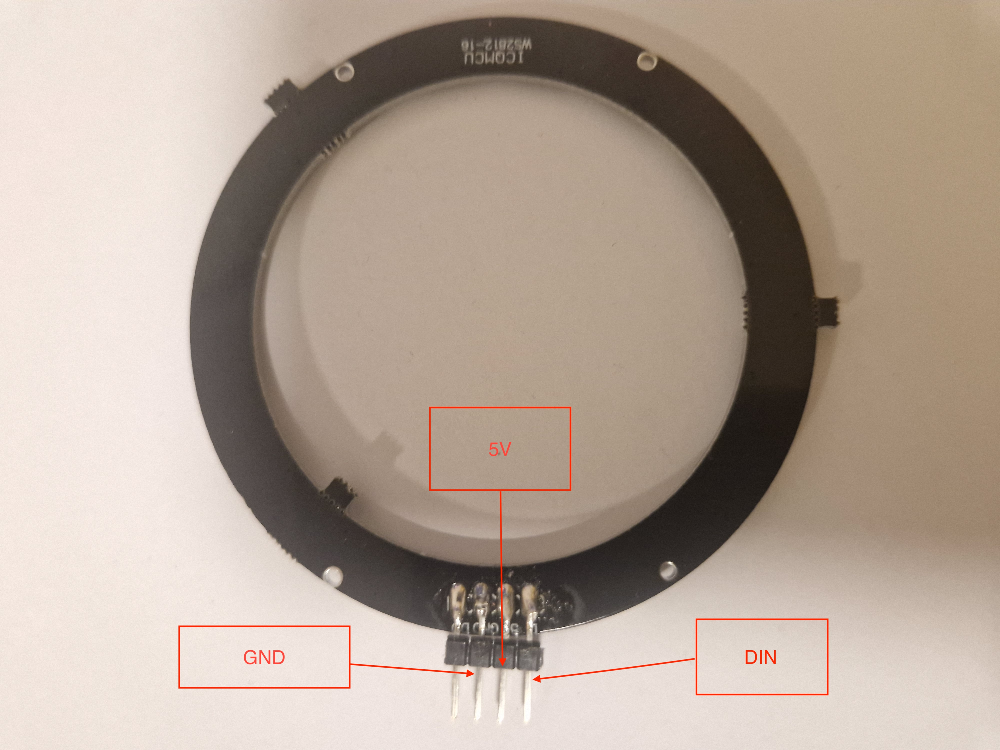
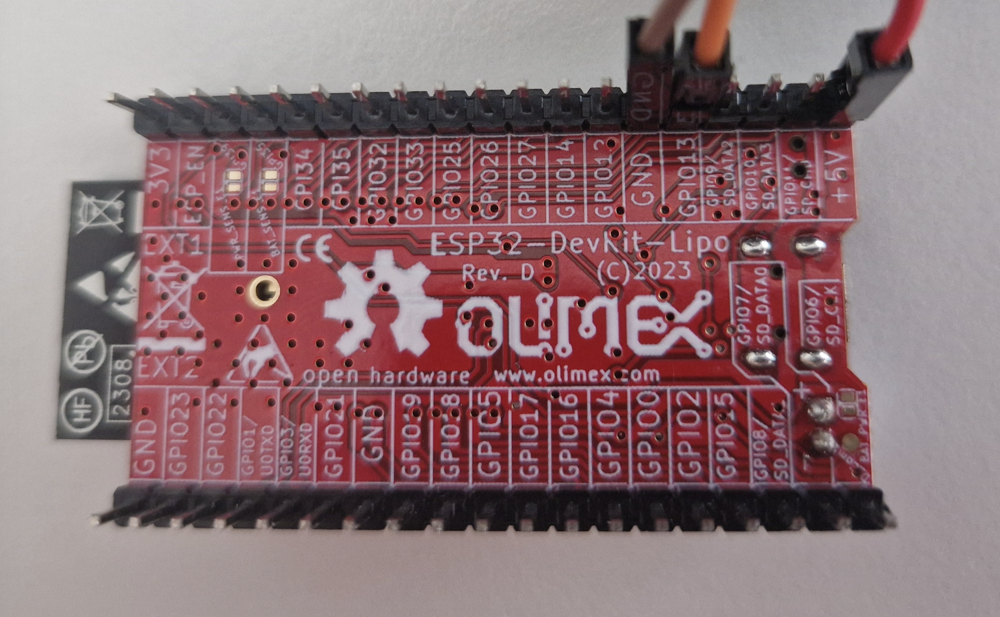
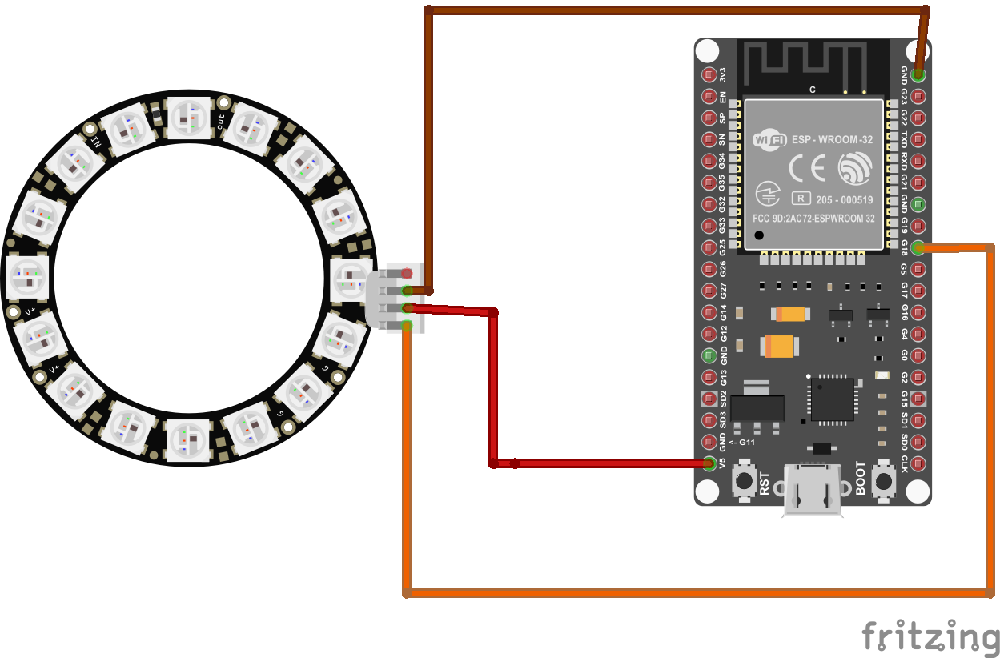
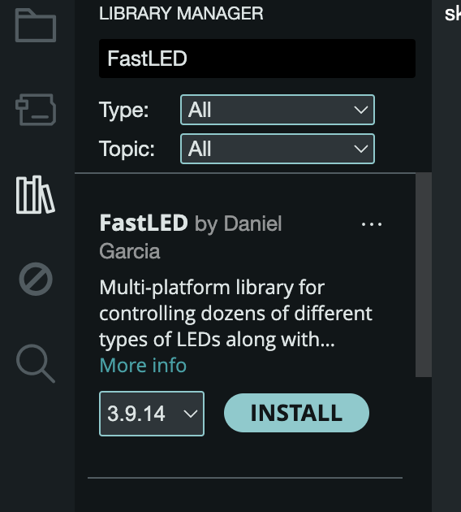

## *NeoPixel / WS2812-16 Ring*

We are using Olimex [ESP32-DevKit-LiPo Board](https://github.com/OLIMEX/ESP32-DevKit-LiPo/blob/master/DOCS/ESP32-DevKit-LiPo-user-manual.pdf)

You already have some components to use:

- **WS2812-16 Ring:**

This NeoPixel/WS2812-16 ring consists of 16 individually addressable RGB LEDs that can all be controlled with a single digital output of a microcontroller and chained together with other rings.



- **[ESP32-DevKit-LiPo Board](https://github.com/OLIMEX/ESP32-DevKit-LiPo/blob/master/DOCS/ESP32-DevKit-LiPo-user-manual.pdf)**.



**Lets connect all together**:


## Schematic and connections

- Pinout of the ESP32 board is shown [here](images/olimex_esp32.png).

- Schematic is [here](images/NeoPixelRingSchema.png).

- We’ll connect WS2812-16 Ring pins with ESP32 pins using wires:
  - "5V" to '+5V' GPIO.
  - "GND" to 'GND' GPIO
  - "DIN" to '18' GPIO


- This is how the components should be connected  (please note the ESP32 board looks different than the red Olimex but the pins are the same):




## Code to Run (Arduino Sketches)
1. **Install the ESP32Servo library**
- Go to Sketch > Include Library > Manage Libraries…
- Search for FastLED.
- Install the library.



2. **Run this sketch in Arduino IDE**, compile it and and upload it.
This code effectively creates a visual effect where the LEDs chase back and forth, and after every 5 cycles, all LEDs turn blue for a brief period..

```cpp
/***

The provided code is an Arduino sketch that controls a ring of NeoPixel LEDs using the FastLED library. The sketch defines the number of LEDs (NUM_LEDS) as 16 and the data pin (DATA_PIN) as 18. An array leds of type CRGB is created to hold the color values for each LED, and an integer roundCounter is initialized to 0 to keep track of the number of completed cycles.

In the setup function, the FastLED.addLeds method is called to initialize the LED array with the specified type (NEOPIXEL) and data pin. This sets up the FastLED library to control the LEDs.

The loop function contains the main logic for controlling the LEDs. It first lights up the LEDs sequentially from the first LED to the last, setting each LED to CRGB::LightCoral and then turning it off after a 200-millisecond delay. This creates a chasing light effect. The same process is then repeated in reverse, lighting up the LEDs from the last to the first.

After completing one forward and one backward cycle, the roundCounter is incremented. If the roundCounter reaches 5, indicating that 5 complete cycles have been performed, all LEDs are set to CRGB::Blue and displayed for 1 second. The roundCounter is then reset to 0, and the process starts over.

This code effectively creates a visual effect where the LEDs chase back and forth, and after every 5 cycles, all LEDs turn blue for a brief period.

***/
#include <FastLED.h>
#define NUM_LEDS 16
#define DATA_PIN 18
CRGB leds[NUM_LEDS];
int roundCounter = 0;

void setup() {
  FastLED.addLeds<NEOPIXEL, DATA_PIN>(leds, NUM_LEDS);
}

void loop() {
  // Light up LEDs from 0 to NUM_LEDS-1
  for (int i = 0; i < NUM_LEDS; i++) {
    leds[i] = CRGB::LightCoral;
    FastLED.show();
    delay(200);
    leds[i] = CRGB::Black;
  }

  // Light up LEDs from NUM_LEDS-1 to 0
  for (int i = NUM_LEDS - 1; i >= 0; i--) {
    leds[i] = CRGB::LightCoral;
    FastLED.show();
    delay(200);
    leds[i] = CRGB::Black;
  }

  // Increment the round counter
  roundCounter++;

  // After 5 rounds, turn all LEDs blue
  if (roundCounter >= 5) {
    for (int i = 0; i < NUM_LEDS; i++) {
      leds[i] = CRGB::Blue;
    }
    FastLED.show();
    delay(1000); // Keep the LEDs blue for 1 second
    roundCounter = 0; // Reset the round counter
  }
}

```
