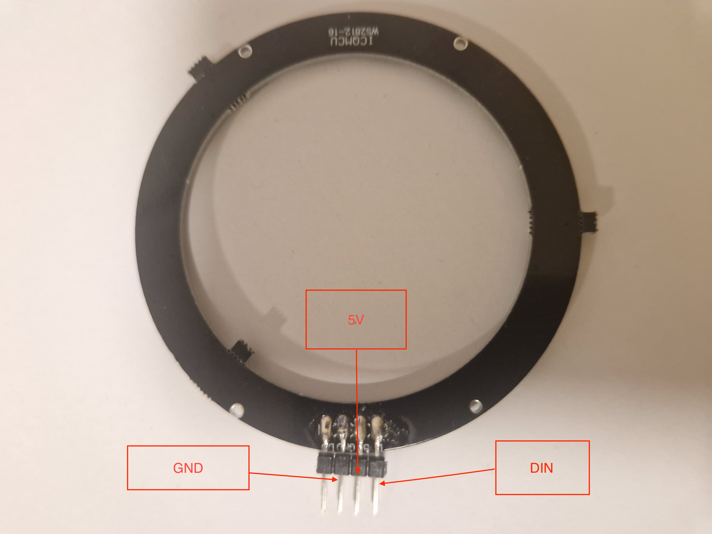
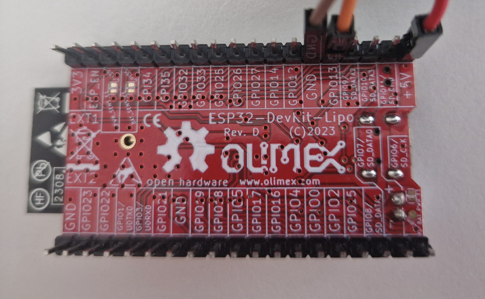
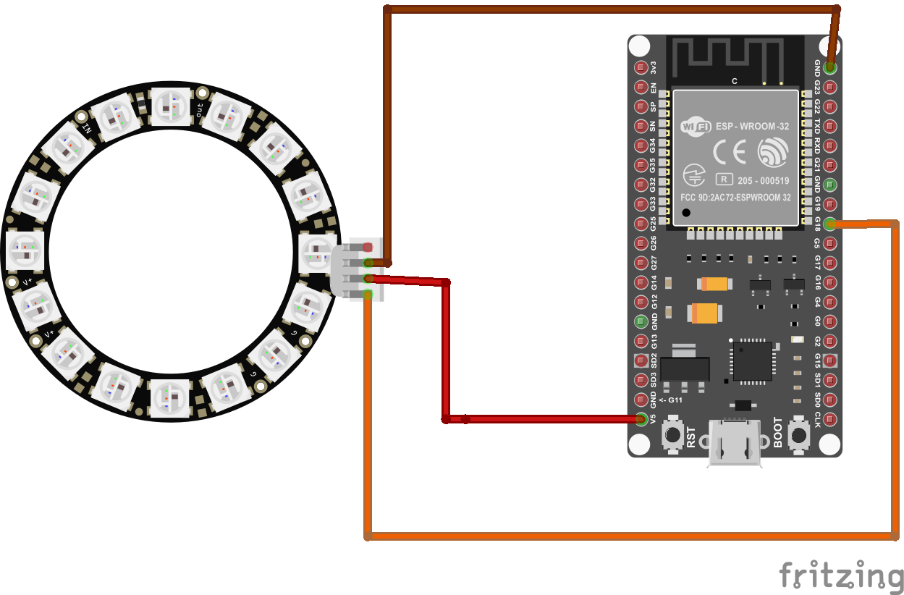
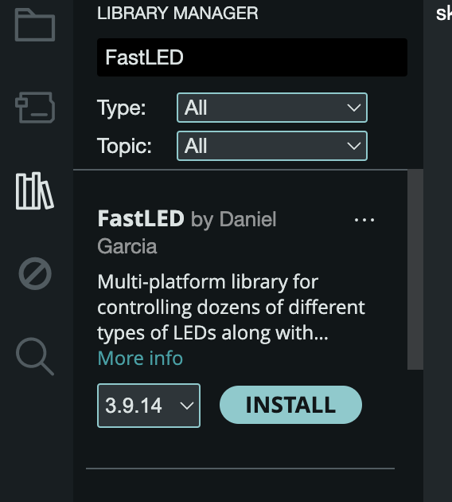

## NeoPixel / WS2812-16 Ring

### What you will learn

- How **addressable LEDs** (WS2812) work — each LED contains a tiny controller chip that receives colour data over a single data wire.
- How to use the **FastLED** library to set individual LED colours, push updates to the strip, and create simple animations.
- Basic wiring between an ESP32 and an external 5 V LED module.

### Components

| Component | Description |
|-----------|-------------|
| **WS2812-16 Ring** | A ring of 16 individually addressable RGB LEDs controlled through a single data line. |
| **ESP32-DevKit-LiPo** | [Olimex ESP32-DevKit-LiPo Board](https://github.com/OLIMEX/ESP32-DevKit-LiPo/blob/master/DOCS/ESP32-DevKit-LiPo-user-manual.pdf) |

### Wiring

Connect the WS2812-16 Ring to the ESP32 as follows:

| WS2812 Pin | ESP32 Pin |
|------------|-----------|
| 5V         | 5V        |
| GND        | GND       |
| DIN        | GPIO 18   |

- Full ESP32 pinout reference: [Olimex ESP32 pinout](images/olimex_esp32.png)
- Schematic: [NeoPixelRingSchema](images/NeoPixelRingSchema.png)

> **Note:** The ESP32 board in the diagram may look different from the red Olimex, but the pin labels are the same.

### Required library

| Library | Author | Install |
|---------|--------|---------|
| **FastLED** | Daniel Garcia | Sketch > Include Library > Manage Libraries… > search **FastLED** |

### Running the sketch

1. Open **NeoPixelRingWS2812.ino** in the Arduino IDE.
2. Make sure the **FastLED** library is installed (see table above).
3. Select your ESP32 board and port under **Tools**.
4. Click **Upload**.

The sketch creates a back-and-forth chasing light effect using `CRGB::LightCoral`. After every 5 complete cycles the entire ring flashes `CRGB::Blue` for one second, then the chase starts again.

### Key concepts in the code

- **`CRGB leds[NUM_LEDS]`** — an array that holds the current colour of each LED.
- **`FastLED.addLeds<NEOPIXEL, DATA_PIN>(...)`** — registers the LED strip so the library knows the chip type and which GPIO to use.
- **`FastLED.show()`** — pushes the colour array to the physical LEDs. Nothing changes on the ring until this is called.
- **`CRGB::Black`** — turning an LED "off" simply means setting its colour to black (all channels zero).
