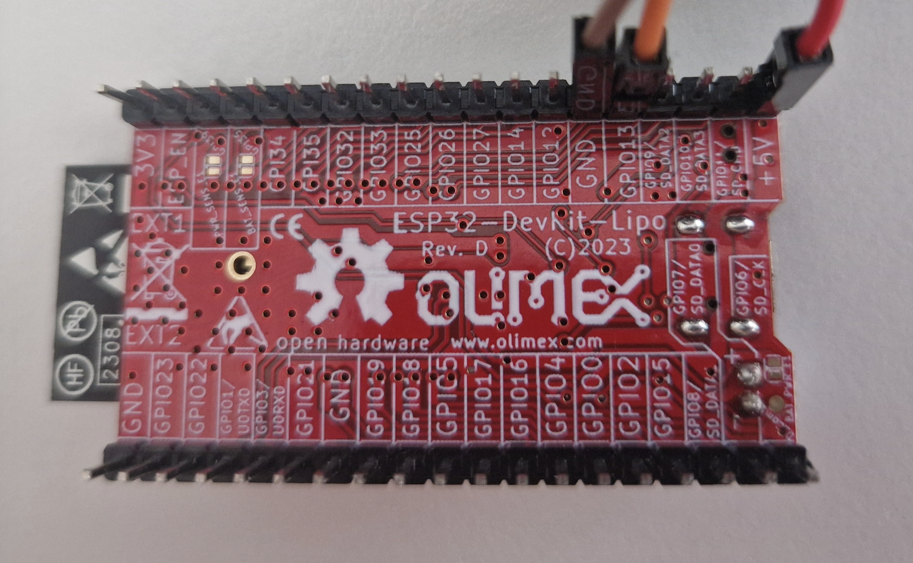
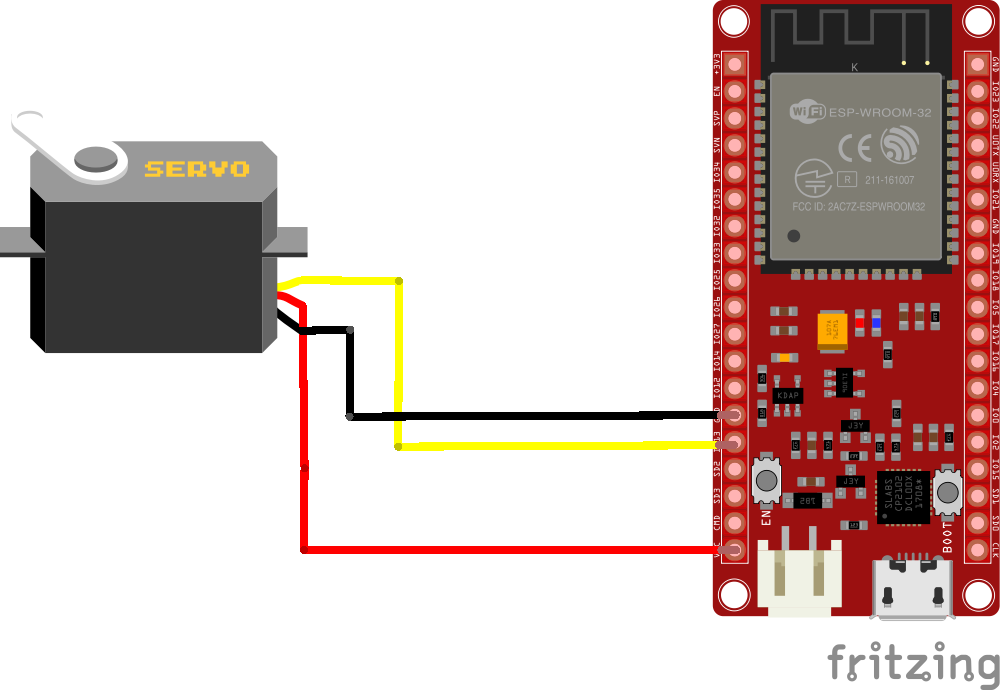
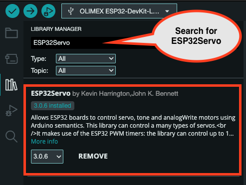

## *Stepper motor*

We are using Olimex [ESP32-DevKit-LiPo Board](https://github.com/OLIMEX/ESP32-DevKit-LiPo/blob/master/DOCS/ESP32-DevKit-LiPo-user-manual.pdf) 

You already have some components to use:

- **Servo Futaba S3003 :**

A servomotor is a rotary or linear actuator that allows for precise control of angular or linear position, velocity, and acceleration in a mechanical system. 

 

- **[ESP32-DevKit-LiPo Board](https://github.com/OLIMEX/ESP32-DevKit-LiPo/blob/master/DOCS/ESP32-DevKit-LiPo-user-manual.pdf)**.



**Lets connect all together**:


## Schematic and connections

- Pinout of the ESP32 board is shown [here](images/olimex_esp32.png).

- Schematic is [here](images/servo_schematic.png).

- We’ll connect servo wires:
  - "RED" to '+5V' GPIO. 
  - "BROWN" to 'GND' GPIO
  - "Yellow" to '13' GPIO


- This is how the components should be connected  (please note the ESP32 board looks different than the red Olimex but the pins are the same):




## Code to Run (Arduino Sketches)
1. **Install the ESP32Servo library**
- Go to Sketch > Include Library > Manage Libraries…
- Search for ESP32Servo.
- Install the library.



2. **Run this sketch in Arduino IDE**, compile it and and upload it to the board. 
The servo position will change from 180 to 0 degrees and then 0 to 180 degrees. This back-and-forth movement of the servo motor continues indefinitely, causing the servo to sweep smoothly between the two positions.

```cpp
/*
The provided code is an Arduino sketch that demonstrates how to control a servo motor using the ESP32Servo library. The sketch begins by defining a constant `servoPin` with a value of 13, which represents the GPIO pin on the ESP32 to which the servo motor is connected. An instance of the Servo class, named `servo1`, is then created to control the servo motor.

In the `setup` function, the serial communication is initialized with a baud rate of 115200 using `Serial.begin(115200)`. This allows for communication between the ESP32 and a connected computer, which can be useful for debugging or monitoring the servo motor's behavior. The servo motor is then attached to the specified pin (servoPin) using the `attach` method of the Servo class.

The `loop` function contains the main logic for controlling the servo motor. It consists of two for-loops that move the servo motor back and forth between 0 and 180 degrees. The first for-loop increments the servo position from 0 to 180 degrees in steps of 1 degree. For each position, the `write` method of the Servo class is called to set the servo to the specified angle, and the current position is printed to the serial monitor using `Serial.println(posDegrees)`. A delay of 20 milliseconds is added between each step to control the speed of the servo movement.

The second for-loop decrements the servo position from 180 to 0 degrees, following the same process as the first loop. This back-and-forth movement of the servo motor continues indefinitely, causing the servo to sweep smoothly between the two positions.
*/

#include <ESP32Servo.h>

static const int servoPin = 13;

Servo servo1;

void setup() {

  Serial.begin(115200);
  servo1.attach(servoPin);
}

void loop() {
  for(int posDegrees = 0; posDegrees <= 180; posDegrees++) {
    servo1.write(posDegrees);
    Serial.println(posDegrees);
    delay(20);
  }

  for(int posDegrees = 180; posDegrees >= 0; posDegrees--) {
    servo1.write(posDegrees);
    Serial.println(posDegrees);
    delay(20);
  }
}
```
