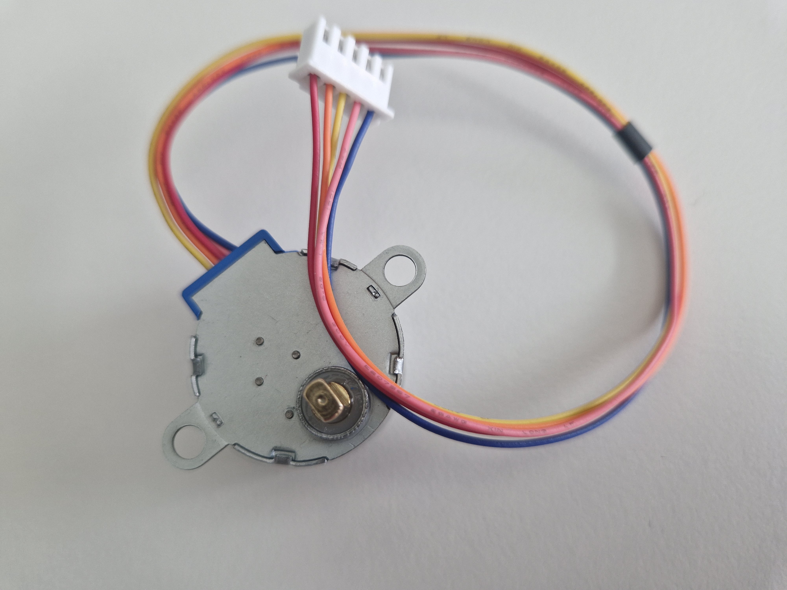
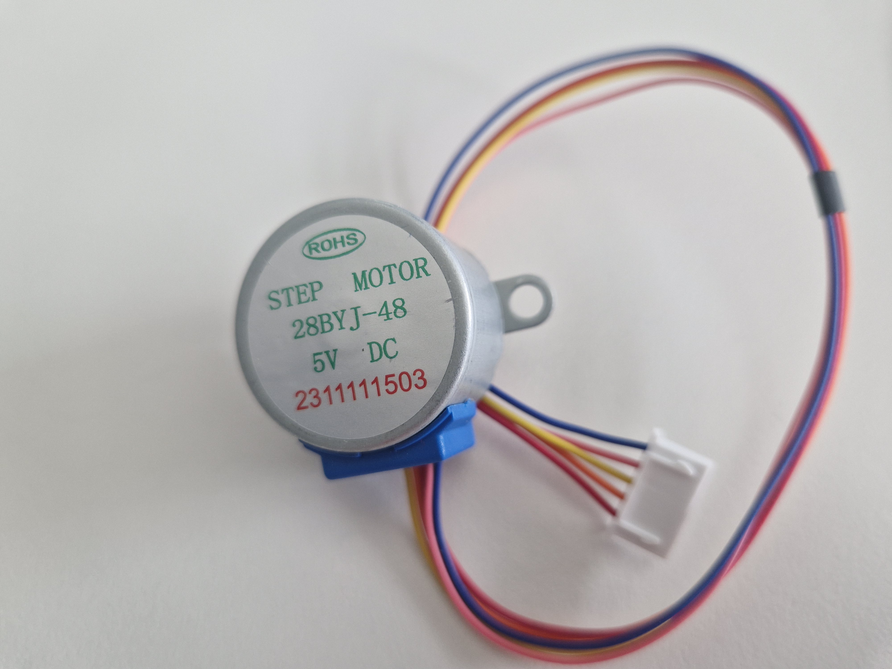
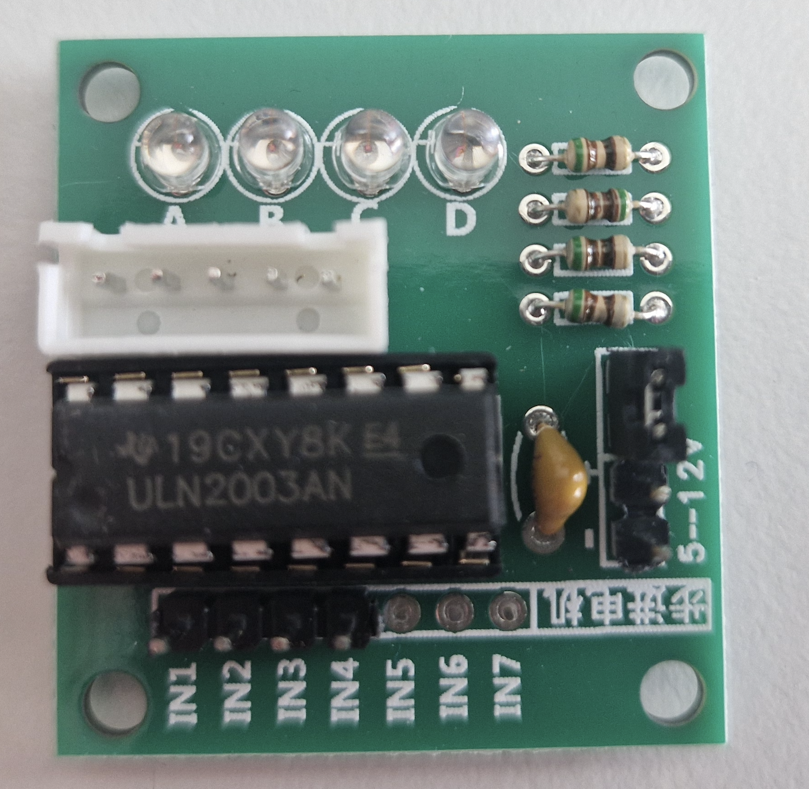
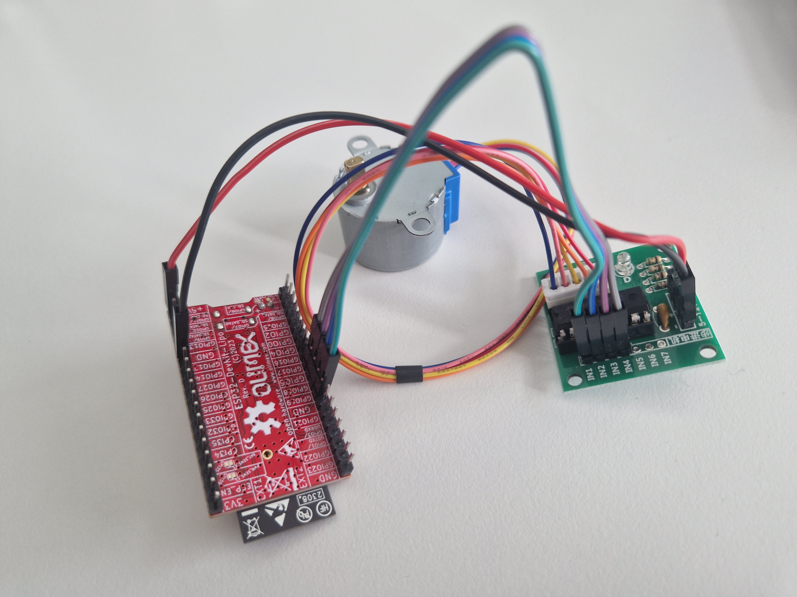
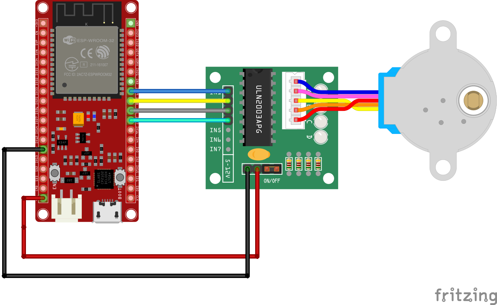

## *Stepper motor*

We are using Olimex [ESP32-DevKit-LiPo Board](https://github.com/OLIMEX/ESP32-DevKit-LiPo/blob/master/DOCS/ESP32-DevKit-LiPo-user-manual.pdf) 

You already have some components to use:

 - **stepper motor 28BYJ-48:**

 A stepper motor is a brushless DC electric motor that divides a full rotation into a number of steps. It moves one step at a time, and each step is the same size

 

**ULN2003 Motor Driver**.
To interface the stepper motor with the ESP32, we’ll use the ULN2003 motor driver, as shown in the figure below. 


**Lets connect all together**:



## Schematic and connections

- Pinout of the ESP32 board is shown [here](images/olimex_esp32.png).

- Schematic is [here](images/schematic_stepper.png).

- We’ll connect IN1, IN2, IN3, and IN4 to GPIOs 19, 18, 5, and 17. You can use any other suitable digital pins 

- ULN2003 driver '+' pin is connected to ESP32 '+5V' pin. The '-' pin to the ESP32 'GND' pin.

- This is how the components should be connected  (please note the ESP32 board looks different than the red Olimex but the pins are the same):




## Code to Run (Arduino Sketches)

1. Run this sketch in Arduino IDE, compile it and and upload it to the board. The stepper will start to rotate slowly to make 1024 steps per revolution with 5 revolutions per minite.

```cpp
/*
The provided code is an Arduino sketch that demonstrates how to control a stepper motor using the Stepper library. The sketch begins by including the Stepper library with `#include <Stepper.h>`, which provides the necessary functions to control the stepper motor.

A constant `stepsPerRevolution` is defined with a value of 1024, representing the number of steps the motor needs to complete one full revolution. This value can be adjusted to match the specifications of the stepper motor being used.

The ULN2003 motor driver pins are defined using `#define` directives. These pins (IN1, IN2, IN3, and IN4) are connected to the Arduino and control the stepper motor. The specific pin numbers (19, 18, 5, and 17) correspond to the digital pins on the Arduino board.

An instance of the Stepper class, named `myStepper`, is created and initialized with the number of steps per revolution and the pin numbers. This instance will be used to control the stepper motor.

In the `setup` function, the speed of the stepper motor is set to 5 revolutions per minute (rpm) using the `setSpeed` method. Additionally, the serial port is initialized with a baud rate of 115200 using `Serial.begin(115200)`. This allows for communication between the Arduino and a connected computer, which can be useful for debugging or monitoring the motor's behavior.

The `loop` function contains the main logic for controlling the stepper motor. It first prints "Going clockwise" to the serial monitor and then commands the motor to step one full revolution in the clockwise direction using `myStepper.step(stepsPerRevolution)`. After a delay of 1000 milliseconds (1 second), it prints "Going counterclockwise" to the serial monitor and commands the motor to step one full revolution in the counterclockwise direction using `myStepper.step(-stepsPerRevolution)`. This loop repeats indefinitely, causing the motor to alternate between clockwise and counterclockwise rotations.
*/
#include <Stepper.h>

const int stepsPerRevolution = 1024;  // change this to fit the number of steps per revolution

// ULN2003 Motor Driver Pins
#define IN1 19
#define IN2 18
#define IN3 5
#define IN4 17

// initialize the stepper library
Stepper myStepper(stepsPerRevolution, IN1, IN3, IN2, IN4);

void setup() {
  // set the speed at 5 rpm
  myStepper.setSpeed(5);
  // initialize the serial port
  Serial.begin(115200);
}

void loop() {
  // step one revolution in one direction:
  Serial.println("Going clockwise");
  myStepper.step(stepsPerRevolution);
  delay(1000);

  // step one revolution in the other direction:
  Serial.println("Going counterclockwise");
  myStepper.step(-stepsPerRevolution);
  delay(1000);
}
```
