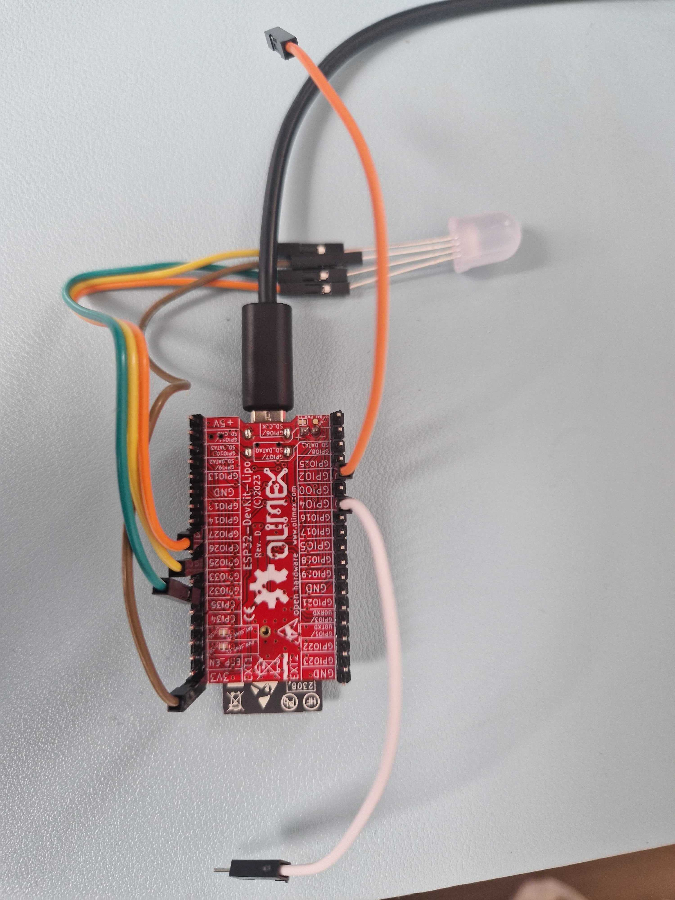
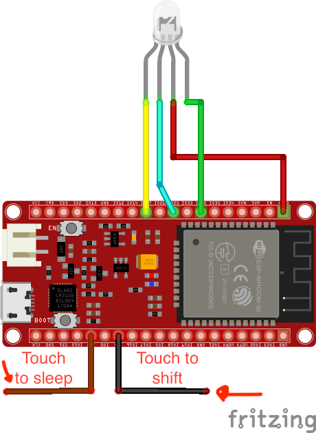

## *ESP32 Deep Sleep and Wake Up Sources*

We are using Olimex [ESP32-DevKit-LiPo Board](https://github.com/OLIMEX/ESP32-DevKit-LiPo/blob/master/DOCS/ESP32-DevKit-LiPo-user-manual.pdf) 

## Schematic and connections

- Pinout of the ESP32 board is shown [here](images/olimex_esp32.png).
- Bredboard can be used, if missing just use some wires:
 

- We'll connect the ESP32 to RGB LED a f/f wires:
 -  _GPIO25_ - LED pin 1
 -  _GPIO27_ - LED pin 3
 -  _GPIO32_ - LED pin 4
 - _3V3 PIN_ - to the LONGEST LED pin (pin2 )



## Code to Run (Arduino Sketches)

1. Run this sketch in Arduino IDE, compile it and and upload it to the board. Depending to the mode is chosen it demonstrates the sleep modes lightSleep, deepSleep, hibernate:

**!! Function wanted to be demonstrated shoud be commented out.!!**

```See code line 169-173```
// Set the desired sleep mode from among:
        // lightSleep();
        // deepSleep();
        // hibernate()

```cpp
#include <EEPROM.h>

// ----------------------------------------------------------------------------
// Definition of LED properties
// ----------------------------------------------------------------------------
//                                  RED        YELLOW        GREEN
//                                   0            1            2
const gpio_num_t LED_PINS[] = { GPIO_NUM_27, GPIO_NUM_25, GPIO_NUM_32 };
const uint8_t    LED_NUMBER = 3;

// defines the index of the active LED:
//
// - this statement is enough to go into light sleep
// uint8_t ledIndex = 0;
//
// - you have to save the data in the RTC memory when you go into deep sleep
RTC_DATA_ATTR uint8_t ledIndex = 0;

// ----------------------------------------------------------------------------
// Definition of time control parameters
// ----------------------------------------------------------------------------

const uint16_t LOOP_FREQUENCY = 25;                    // Hz
const uint16_t WAIT_PERIOD    = 1000 / LOOP_FREQUENCY; // ms

struct Timer {
    uint32_t laptime;
    uint32_t ticks;
};

Timer timer;

// ----------------------------------------------------------------------------
// Definition of touch pin properties
// ----------------------------------------------------------------------------

const touch_pad_t SHIFT_TOUCH_PIN = TOUCH_PAD_NUM4; // GPIO 4
const touch_pad_t SLEEP_TOUCH_PIN = TOUCH_PAD_NUM2; // GPIO 2

const uint16_t TOUCH_THRESHOLD = 40; // Adjust based on sensitivity

// ----------------------------------------------------------------------------
// Definition of sleep mode properties
// ----------------------------------------------------------------------------
//                           seconds
//                              v
const uint32_t SLEEP_DURATION = 4 * 1000000; // µs

// ----------------------------------------------------------------------------
// Initialization
// ----------------------------------------------------------------------------

// forward declaration
void flashActiveLED();

void setup() {
    // configure the touch pins
    touchAttachInterrupt(SHIFT_TOUCH_PIN, nullptr, TOUCH_THRESHOLD);
    touchAttachInterrupt(SLEEP_TOUCH_PIN, nullptr, TOUCH_THRESHOLD);

    // configures the LED pins
    for (uint8_t i = 0; i < LED_NUMBER; i++) {
        pinMode(LED_PINS[i], OUTPUT);
    }

    // turns on the active LED
    digitalWrite(LED_PINS[ledIndex], LOW);

    // initializes the timer
    timer = { millis(), 0 };

    // we only need 1 byte to save ledIndex value
    EEPROM.begin(1);

    // flash the active LED only after a deep sleep or hibernation
    if (esp_sleep_get_wakeup_cause() == ESP_SLEEP_WAKEUP_TIMER) {
        // In hibernation mode, the only way to save data is to host it in the EEPROM.
        // The value stored at address 0x0000 is assigned to ledIndex.
        ledIndex = EEPROM.read(0);
        flashActiveLED();
    }
}

// ----------------------------------------------------------------------------
// Active LED lighting
// ----------------------------------------------------------------------------

void updateLED() {
    for (uint8_t i = 0; i < LED_NUMBER; i++) {
        digitalWrite(LED_PINS[i], i == ledIndex ? LOW : HIGH);
    }
}

void flashActiveLED() {
    for (uint8_t i = 0; i <= 10; i++) {
        digitalWrite(LED_PINS[ledIndex], i % 2 == 0 ? LOW : HIGH);
        delay(100);
    }
}

// ----------------------------------------------------------------------------
// Touch status handling
// ----------------------------------------------------------------------------

bool isTouched(touch_pad_t touchPin) {
    uint16_t touchValue = touchRead(touchPin); // Correct usage of touchRead()
    return touchValue < TOUCH_THRESHOLD;
}

// ----------------------------------------------------------------------------
// Microcontroller sleep modes
// ----------------------------------------------------------------------------

void lightSleep() {
    esp_sleep_enable_timer_wakeup(SLEEP_DURATION);
    esp_light_sleep_start();
}

void deepSleep() {
    esp_sleep_enable_timer_wakeup(SLEEP_DURATION);
    esp_deep_sleep_start();
}

void hibernate() {
    // Save the current LED index to EEPROM
    EEPROM.write(0, ledIndex);
    EEPROM.commit();

    // Turn off all LEDs before entering hibernation
    for (uint8_t i = 0; i < LED_NUMBER; i++) {
        digitalWrite(LED_PINS[i], HIGH); // Set LEDs to HIGH (off for active-low LEDs)
    }

    // Enter deep sleep (hibernation)
    esp_sleep_enable_timer_wakeup(SLEEP_DURATION);
    esp_deep_sleep_start();
}

// ----------------------------------------------------------------------------
// Time control of the main loop
// ----------------------------------------------------------------------------

void waitForNextCycle() {
    uint32_t now;
    do { now = millis(); } while (now - timer.laptime < WAIT_PERIOD);
    timer.laptime = now;
    timer.ticks++;
}

// ----------------------------------------------------------------------------
// Main control loop
// ----------------------------------------------------------------------------

void loop() {
    static bool wasTouchedShift = false;
    static bool wasTouchedSleep = false;

    bool isCurrentlyTouchedShift = isTouched(SHIFT_TOUCH_PIN);
    bool isCurrentlyTouchedSleep = isTouched(SLEEP_TOUCH_PIN);

    // Detect release for SHIFT_TOUCH_PIN
    if (wasTouchedShift && !isCurrentlyTouchedShift) {
        ++ledIndex %= LED_NUMBER;
        updateLED();
        delay(500); // Debounce delay
    }

    // Detect release for SLEEP_TOUCH_PIN
    if (wasTouchedSleep && !isCurrentlyTouchedSleep) {
        // Set the desired sleep mode from among:
        // lightSleep();
        // deepSleep();
        // hibernate();
        hibernate();

        // Flash the active LED only after a light sleep
        flashActiveLED();
    }

    // Update the previous state
    wasTouchedShift = isCurrentlyTouchedShift;
    wasTouchedSleep = isCurrentlyTouchedSleep;

    waitForNextCycle();
}


```
