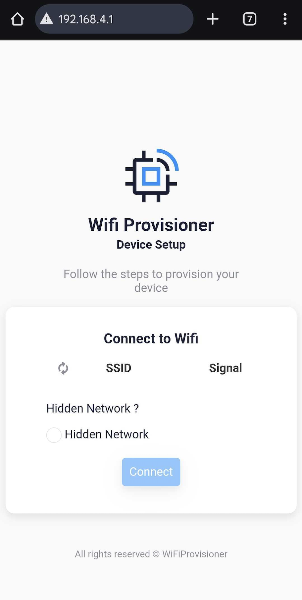

# *WiFiProvisioner library*

We are using Olimex [ESP32-DevKit-LiPo Board](https://github.com/OLIMEX/ESP32-DevKit-LiPo/blob/master/DOCS/ESP32-DevKit-LiPo-user-manual.pdf)

You already have some components to use:

- **[ESP32-DevKit-LiPo Board](https://github.com/OLIMEX/ESP32-DevKit-LiPo/blob/master/DOCS/ESP32-DevKit-LiPo-user-manual.pdf)**.


## Schematic and connections

- Pinout of the ESP32 board is shown [here](images/olimex_esp32.png).

## Code to Run (Arduino Sketches)

1. **Install the WiFiProvisioner library**

- Go to Sketch > Include Library > Manage Libraries…
- Search for WiFiProvisioner.
- Install the library.


2. **Run this sketch in Arduino IDE**, This code demonstrates how to use the WiFiProvisioner library to configure WiFi credentials for an ESP32 device. The WiFiProvisioner library allows
users to set up WiFi credentials dynamically, making it easier to connect
the device to a network without hardcoding SSID and password.

- 1.Open 192.168.4.1 and see the available WiFi SSIDs.
- 2.Select the SSID
- 3.Enter a WiFi password.



```cpp
/*
WiFi Provisioning Example
=====================================
This code demonstrates how to use the WiFiProvisioner library to configure
WiFi credentials for an ESP32 device. The WiFiProvisioner library allows
users to set up WiFi credentials dynamically, making it easier to connect
the device to a network without hardcoding SSID and password.

Key Features:
- Dynamically configure WiFi credentials using a provisioning interface.
- Hide additional input fields (e.g., reset or custom fields) for simplicity.
- Provide a callback function to handle successful provisioning.

How It Works:
1. The `WiFiProvisioner` instance is created and configured.
2. Additional input fields (e.g., reset or custom fields) are disabled for simplicity.
3. A success callback is defined to handle the event when WiFi credentials are successfully provisioned.
4. The provisioning process is started, allowing the user to input WiFi credentials.
5. Once provisioning is complete, the device connects to the specified WiFi network.
*/

#include <WiFiProvisioner.h>

void setup() {
  Serial.begin(9600);

  // Create the WiFiProvisioner instance
  WiFiProvisioner provisioner;

  // Configure to hide additional fields
  provisioner.getConfig().SHOW_INPUT_FIELD = false; // No additional input field
  provisioner.getConfig().SHOW_RESET_FIELD = false; // No reset field

  // Set the success callback
  provisioner.onSuccess(
      [](const char *ssid, const char *password, const char *input) {
        Serial.printf("Provisioning successful! Connected to SSID: %s\n", ssid);
        if (password) {
          Serial.printf("Password: %s\n", password);
        }
      });

  // Start provisioning
  provisioner.startProvisioning();
}

void loop() { delay(100); }

```
