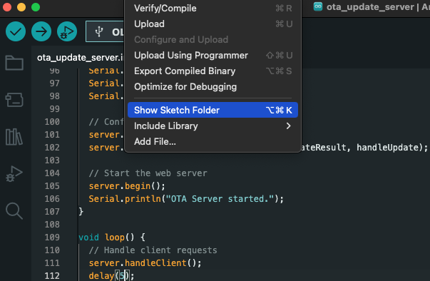

# *ESP32 OTA Server Example*

We are using Olimex [ESP32-DevKit-LiPo Board](https://github.com/OLIMEX/ESP32-DevKit-LiPo/blob/master/DOCS/ESP32-DevKit-LiPo-user-manual.pdf)

You already have some components to use:

- **[ESP32-DevKit-LiPo Board](https://github.com/OLIMEX/ESP32-DevKit-LiPo/blob/master/DOCS/ESP32-DevKit-LiPo-user-manual.pdf)**.


## Schematic and connections

- Pinout of the ESP32 board is shown [here](images/olimex_esp32.png).

## Code to Run (Arduino Sketches)

1. **No need to install any library**

2. **Run this sketch in Arduino IDE**:
 - The provided code sets up an ESP32 OTA (Over-The-Air) Update Server, allowing you to upload new firmware to the ESP32 via a web interface. Here's what is expected to happen:

1. ESP32 Connects to WiFi
The ESP32 attempts to connect to the WiFi network using the provided SSID and password.
Once connected, the ESP32 prints its assigned IP address to the Serial Monitor.
2. Web Server Starts
A web server is created on port 80.
The server listens for HTTP requests and serves specific routes:
"/" ->  Displays an HTML page with a file upload form for the OTA update.
"/update" -> Handles the firmware upload and writes it to the ESP32's flash memory.
3. Access the OTA Web Interface
Open a web browser and navigate to the ESP32's IP address provided in the Serial Monitor(e.g., http://192.168.1.100/).
The browser displays a simple HTML page with a file upload form.
4. Upload New Firmware
Use the file upload form to select and upload a new firmware .bin file.
The ESP32 processes the uploaded file:
It starts writing the firmware to flash memory.
If the upload is successful, the ESP32 reboots to apply the new firmware.
If the upload fails, an error message is displayed.
5. Serial Monitor Output
During the process, the ESP32 prints debug messages to the Serial Monitor, such as:
WiFi connection status.
IP address.
OTA update progress (e.g., "Update Start", "Update Success", or error messages).

```cpp
/*
ESP32 OTA Server Example
=========================
This code demonstrates how to set up an OTA server on the ESP32.
It creates a web server that allows you to upload new firmware to the ESP32
via a web interface.

Steps:
1. Connect the ESP32 to a WiFi network.
2. Access the OTA web interface via the ESP32's IP address.
3. Upload the new firmware file (.bin) through the web interface.
*/

#include <WiFi.h>
#include <WebServer.h>
#include <Update.h>

// Replace with your network credentials
const char* ssid = "your SSID";
const char* password = "your SSID password";

// Create a web server on port 80
WebServer server(80);

// HTML page for the OTA update interface
const char* updatePage = R"rawliteral(
<!DOCTYPE html>
<html>
  <head>
    <title>ESP32 OTA Update</title>
  </head>
  <body>
    <h1>ESP32 OTA Update</h1>
    <form method="POST" action="/update" enctype="multipart/form-data">
      <input type="file" name="firmware">
      <input type="submit" value="Update">
    </form>
  </body>
</html>
)rawliteral";

// Handle the root URL
void handleRoot() {
  server.send(200, "text/html", updatePage);
}

// Handle the firmware upload
void handleUpdate() {
  HTTPUpload& upload = server.upload();

  if (upload.status == UPLOAD_FILE_START) {
    Serial.printf("Update Start: %s\n", upload.filename.c_str());
    if (!Update.begin(UPDATE_SIZE_UNKNOWN)) {
      Update.printError(Serial);
      return;
    }
  } else if (upload.status == UPLOAD_FILE_WRITE) {
    if (Update.write(upload.buf, upload.currentSize) != upload.currentSize) {
      Update.printError(Serial);
    }
  } else if (upload.status == UPLOAD_FILE_END) {
    if (Update.end(true)) {
      Serial.printf("Update Success: %u bytes\n", upload.totalSize);
    } else {
      Update.printError(Serial);
    }
  }
}

// Handle the update result
void handleUpdateResult() {
  if (Update.hasError()) {
    server.send(200, "text/plain", "Update Failed");
  } else {
    server.send(200, "text/plain", "Update Successful. Rebooting...");
    delay(1000);
    ESP.restart();
  }
}

void setup() {
  // Start Serial communication
  Serial.begin(115200);
  delay(1000);

  // Connect to WiFi
  WiFi.begin(ssid, password);
  Serial.println("Connecting to WiFi...");
  while (WiFi.status() != WL_CONNECTED) {
    delay(500);
    Serial.print(".");
  }
  Serial.println("\nWiFi connected.");
  Serial.print("IP Address: ");
  Serial.println(WiFi.localIP());

  // Configure web server routes
  server.on("/", HTTP_GET, handleRoot);
  server.on("/update", HTTP_POST, handleUpdateResult, handleUpdate);

  // Start the web server
  server.begin();
  Serial.println("OTA Server started.");
}

void loop() {
  // Handle client requests
  server.handleClient();
  delay(5);
}
```

3. **Generate a .bin file in Arduino IDE**:


-  Modify the last void loop() function code and add:
```
  Serial.println("Hello I am OTA Updated!!!.");
  delay(2000);
```
so the void loop() function is:
```
void loop() {
  // Handle client requests
  server.handleClient();
  delay(5);
  Serial.println("Hello I am OTA Updated!!!.");
  delay(2000);
}
```

- To upload a new sketch to the ESP32, you must first generate a compiled binary .bin file of your sketch.
To do so, navigate to Sketch > Export compiled Binary.


- The .bin file is exported to Sketch folder. On MacOS the .bin file is placed in the sketch directory: build/esp32.esp32.esp32-devkitlipo/ota_update_server.ino.bin (the name of your sketch.ino.bin)


- Open the browser and enter the provided ESP32 IP addess from the serial monitor.
Click on Choose file and browse to the exported .bin file (in the example is ota_update_server.ini.bin)


- click on Update button

