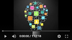

# Курс Internet of Things (IoT)

Лекциите и упражненията по темите се провеждат в един ден. Материалите за всяка лекция/упражнение са в съответната папка.

# Лектори

| Име | Facebook | LinkedIn |
|----|---|---|
|Павел Геневски | | https://www.linkedin.com/in/pavel-genevski-bb075612/ |
|Николай Китанов | https://www.facebook.com/nikolay.kitanov.5/ | https://www.linkedin.com/in/nikolay-kitanov/ |
|Ивайло Димов | | https://www.linkedin.com/in/ivaylo-dimov-8214a1a9/ |
|Велизар Стоянов | | https://www.linkedin.com/in/velizar-stoyanov-40a7a41b9 |
# Хардуерни компоненти
За курсовия проект е осигурен набор от хардуерни компоненти.

# Учебен план

| Дата         | Тема                                 | Лектори           | Видео |
| -------------|:-------------------------------------| -----------------:|:-----:|
| 19.02.2026   | Intro to IoT                         | Павел, Николай    |       |
| 26.02.2026   | Hardware platforms / ESP             | Павел, Николай    |  |
| 05.03.2026   | Sensors                              | Павел, Николай    |  |
| 12.03.2026   | Displays and actuators               | Павел, Николай    |  |
| 19.03.2026   | Practice & Exercises                 | Павел, Николай    |  |
| 26.03.2026   | Connectivity 1                       | Павел, Николай    |  |
| 02.04.2026   | Power management, batteries          | Павел, Николай    |  |
| 09.04.2026   | Vacation (Великден)                  |                   |       |
| 16.04.2026   | Connectivity 2                       | Павел, Николай    |  |
| 23.04.2026   | Security                             | Павел, Николай    |  |
| 30.04.2026   | Device management                    | Павел, Николай    |  |
| 07.05.2026   | Data management and analytics        | Павел, Николай    |  |
| 14.05.2026   | Data management - Exercise           | Павел, Николай    |  |
| 21.05.2026   | Work on course assignments           | Павел, Николай    |       |
| 28.05.2026   | Work on/Present course assignments   | Павел, Николай    |       |
| 04.06.2026   | Present course assignments           | Павел, Николай    |       |

[*Академичен календар](https://www.uni-sofia.bg/index.php/bul/studenti/akademichen_kalendar)

Slot is always the same: 17:15 - 21:00

* Course assignments = присъствено време, в което трябва да представите напредъка си и може да получите помощ от преподавателите
* Present course assignments = възможни дати за финално представяне на курсовите проекти. Предвидени са няколко дати поради големината на групата и скоростта с която различните участници завършват проектите.
